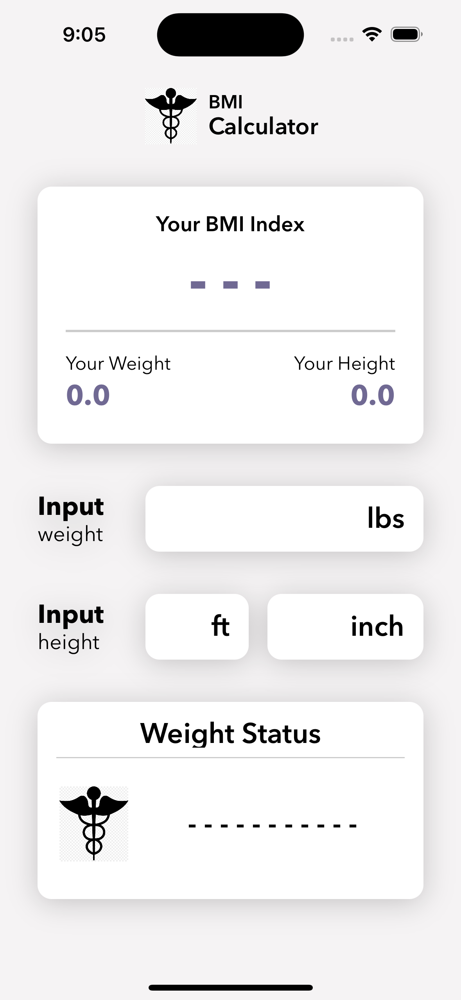
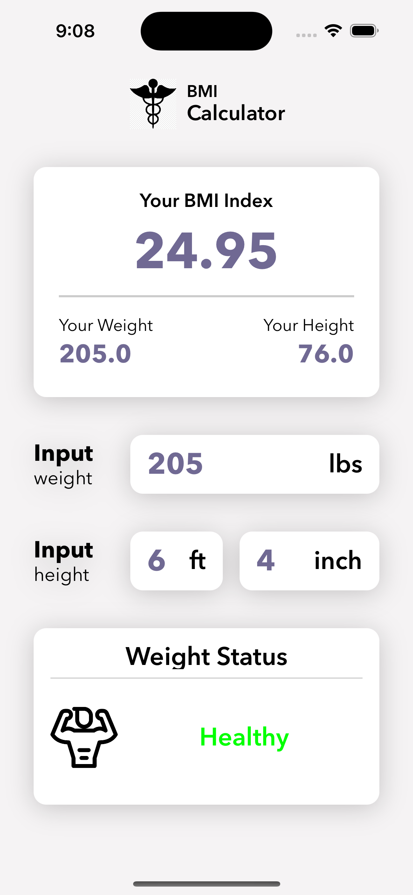
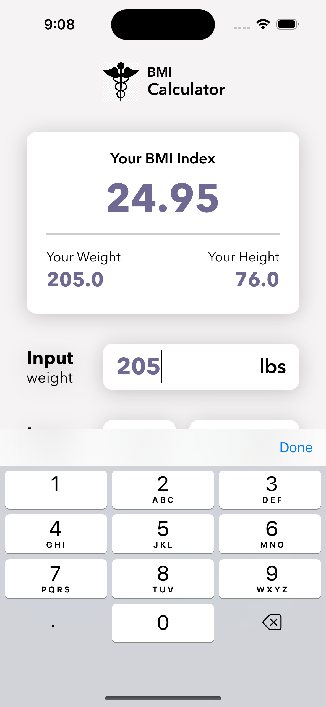

# BMI Calculator

---

## Project Description:
    The BMI Calculator is an interactive iOS app designed for people on a health journey to easily track and understand their Body Mass Index (BMI) metrics. This app allows users to input their weight and height, and the app will calculate their BMI instantly. It also includes a feature to reset inputs and results with ease, enhancing user experience during repeated use.

    The app is built using the Model-View-ViewModel (MVVM) architecture, alongside UIKit for the user interface. It leverages Combine for reactive programming using the Publisher-Subscriber (PubSub) pattern, and SnapKit for layout management.

---

## Simulator Images:

    
    
    

---

## Key Features:
    Interactive BMI Calculation: Input your weight and height (feet and inches), and get instant BMI results.
    
    Reset Functionality: Reset the calculator easily by tapping the logo, which clears all inputs and results.
    
    Real-time Feedback: The app updates the BMI result and status view as soon as new data is entered.
    
    Reactive Programming with Combine: Publishes user input changes and responds in real-time, allowing for seamless updates.
    
---

## Technology Stack:
    MVVM Architecture: Separates the data model, user interface, and logic for better organization, maintainability, and scalability of the app.
    
    UIKit: Handles the user interface, utilizing custom views for input fields and result displays.

    Combine Framework: Utilizes the Publisher-Subscriber pattern to listen for user input changes. The app also uses:
        - PassthroughSubject: Immediately sends any new value to its subscribers.
        - .eraseToAnyPublisher(): Abstracts the type of publishers, providing flexibility and ease in code maintenance.
        - Cancellables: Manages memory, ensuring that any subscriptions to publishers are cleaned up when deallocated.

    SnapKit: Simplifies AutoLayout, providing a clean and concise way to define layout constraints programmatically.
    
    
## Further Development:
    Testing: Need to implement Unit and UI testing.
